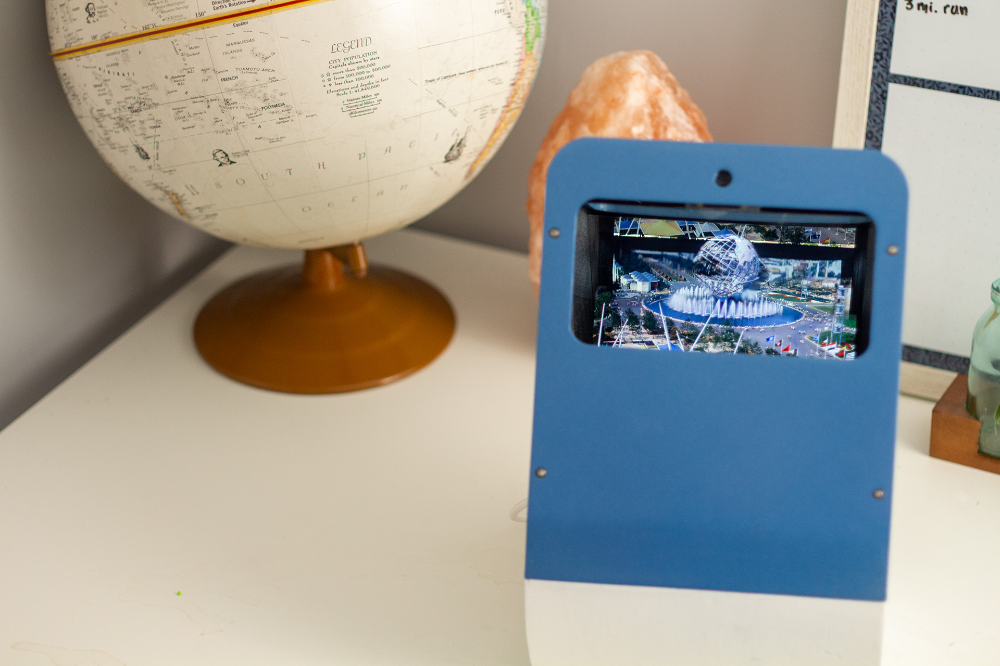
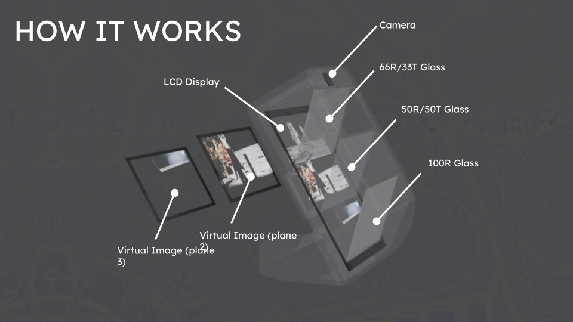
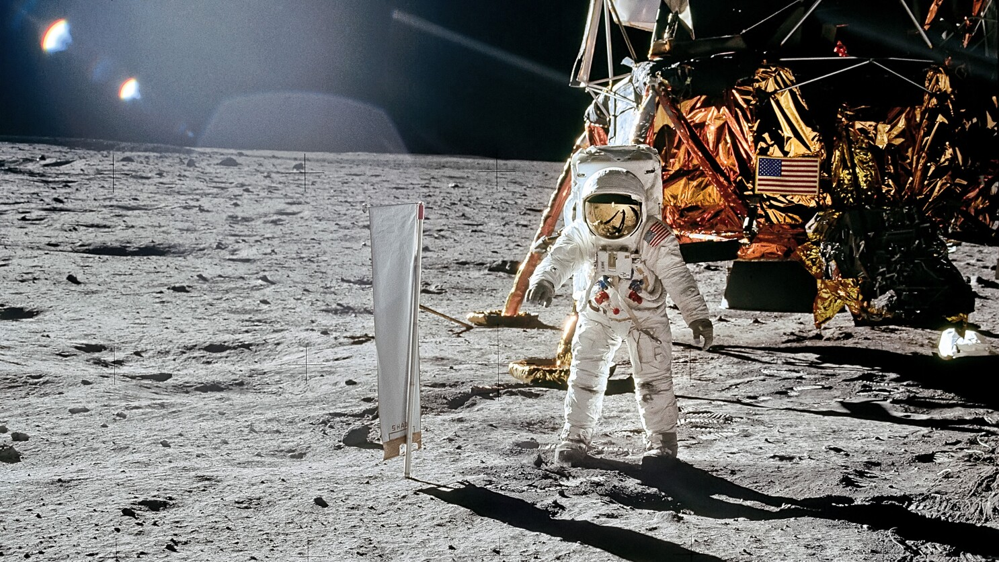
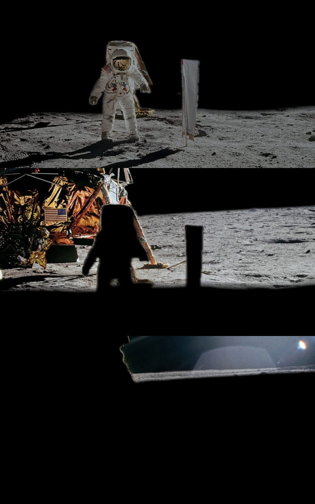
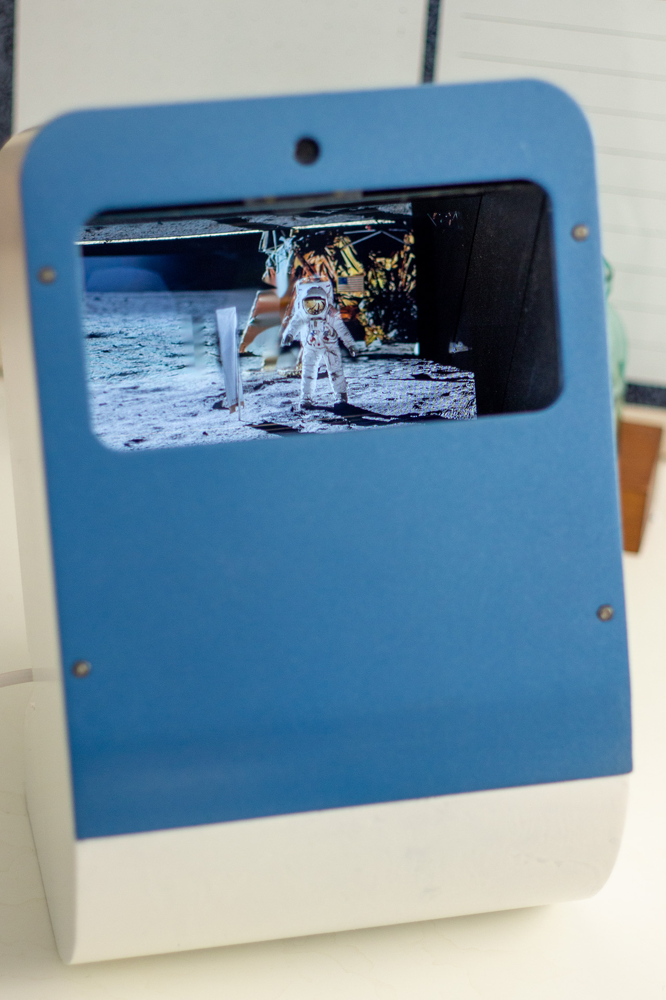
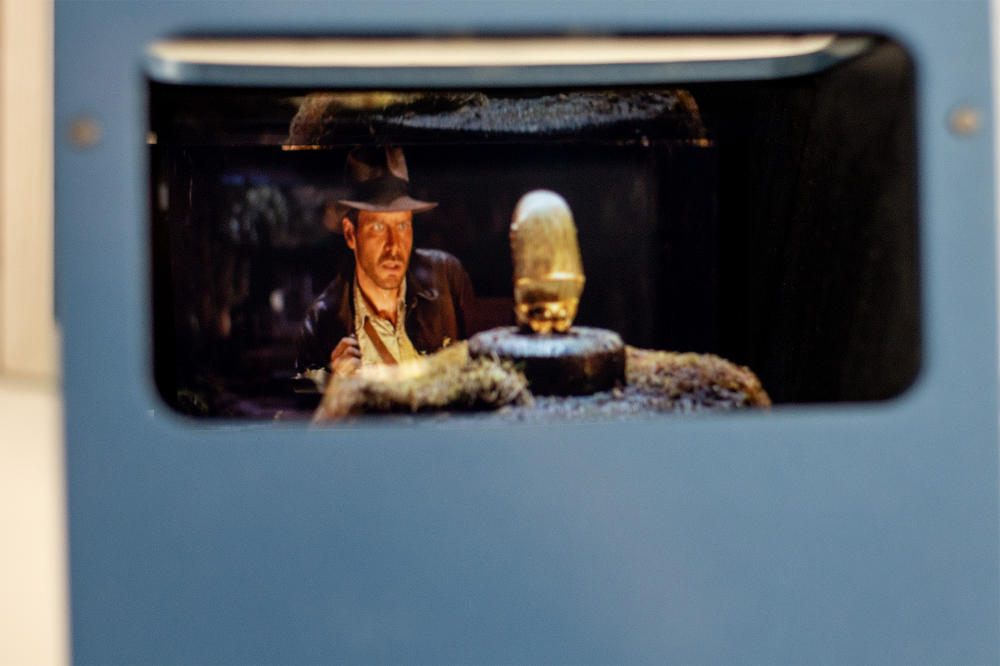
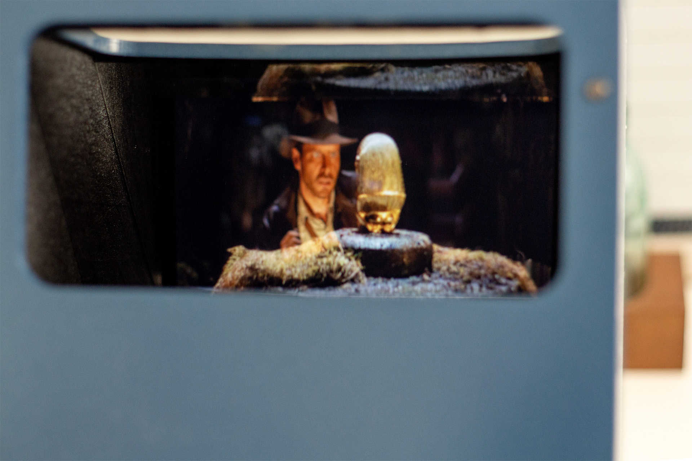
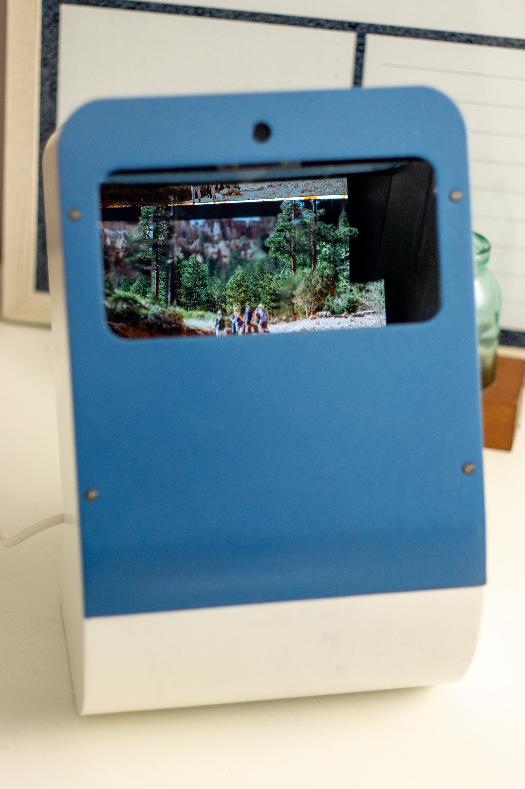

# MultiPlaneDisplay

  

# How does it work?
Multi-Plane Display uses image processing and Pepper's Ghost illusions to enable any photo to be viewed with real depth, creating a "2 and a half D" Illusion.

  

## Workflow

1. **Depth segmentation**  
   A depth map is extracted from the image using *Depth Anything v2* and used to segment the scene into **foreground**, **middleground**, and **background** layers.

2. **Viewer tracking**  
   Monocular head tracking estimates the viewer’s position relative to the display.

3. **Shadow correction**  
   Shadow maps are dynamically adjusted based on the viewer’s position to prevent off-axis ghosting artifacts.

4. **Optical display**  
   The layered images are displayed through a parascope mirror array, producing the virtual display stacking effect.
   
<table align="center">
  <tr>
    <td align="center">
       
      Input Image
    </td>
    <td align="center">
       
      Processed Image
    </td>
    <td width="40"></td>
    <td align="center">
       
      Viewable Result
    </td>
  </tr>
</table>

## Gallery

  
  
  

  

## Features
- Automatic image processing with input from USB drive
- Compatibility with .jpg, .jpeg, .png, and .tiff
- Automated occlusion maps with real-time headtracking
- Automatic Display turn-off and idle mode when unobserved for 30 seconds

## Parts List

- Waveshare 10.1" Display  https://a.co/d/bgIxvvW
- Raspberry Pi 5  https://a.co/d/f5K5WJR
- Cooling Fan  https://a.co/d/cPdcFge
- Semi-reflective acrylic (162x110mm) (optimally use 66/33 and 50/50 teleprompter glass, but this stuff is cheap)  https://a.co/d/37wRoJS
- acrylic mirror  (162x110mm) https://a.co/d/5MYHUT7 
- 8MP camera  https://a.co/d/0b0CgG3
- RPi 5 PSU  https://a.co/d/g17dBXe
- Micro SD card  https://a.co/d/0lqvz4a
- USB Drive  https://a.co/d/dX8yHnJ
- 250 mm CSI cable  https://a.co/d/1fIMcX2

